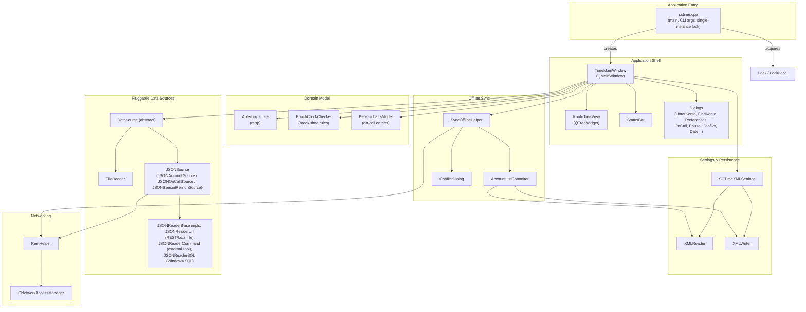
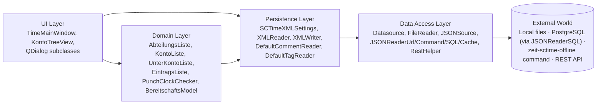
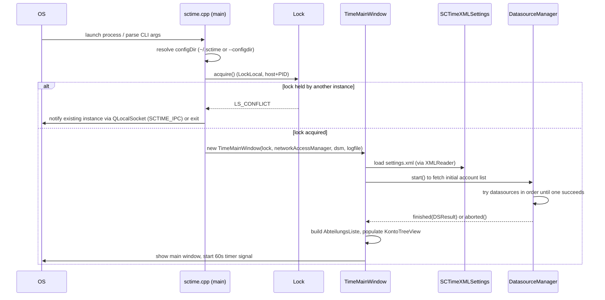

# Architecture Overview

## 1. What sctime does

sctime is a time-recording GUI. Users book worked hours against a tree of
**Departments → Accounts → Sub-Accounts → Entries** ("Abteilung → Konto →
Unterkonto → Eintrag"), optionally track legally-mandated break times via a
**punch clock checker**, and record **on-call ("Bereitschaft") time**. Data is
kept locally as XML and periodically synced with a server over a REST/JSON API.
The same C++ codebase compiles to:

- a native desktop application (Linux, Windows, macOS) using local files and/or
  SQL/command-line data sources, and
- a **WebAssembly** build (`CONFIG += wasm`) that runs in the browser, is
  REST-only, and persists its local "filesystem" in IndexedDB.

## 2. Process / module view

## 3. Core god objects (from the code graph)

These are the highest fan-out types in the codebase — understanding them first
gives the fastest path into the rest of the system.

| Type | File | Role |
|---|---|---|
| `TimeMainWindow` | [src/timemainwindow.h](../src/timemainwindow.h) | Application shell: owns settings, the account tree, the timer tick, dialogs, and orchestrates save/sync/conflict flows |
| `SCTimeXMLSettings` | [src/sctimexmlsettings.h](../src/sctimexmlsettings.h) | All user & app settings; single source of truth read/written as XML |
| `AbteilungsListe` | [src/abteilungsliste.h](../src/abteilungsliste.h) | In-memory domain model: departments → accounts → sub-accounts → time entries |
| `KontoTreeView` | [src/kontotreeview.h](../src/kontotreeview.h) | `QTreeWidget` subclass rendering `AbteilungsListe` and handling drag/drop, editing |
| `FindKontoDialog` | [src/findkontodialog.h](../src/findkontodialog.h) | Search/quick-switch across the account tree |
| `Datasource` / `DatasourceManager` | [src/datasource.h](../src/datasource.h) | Strategy pattern for "where does the account list come from" |
| `XMLReader` / `XMLWriter` | [src/xmlreader.h](../src/xmlreader.h), [src/xmlwriter.h](../src/xmlwriter.h) | Serialize/deserialize settings + daily time entries |
| `ConflictDialog` | [src/conflictdialog.h](../src/conflictdialog.h) | Reconciles local vs. remote edits when they diverge |

## 4. Layering

Notes on the layering:

- The UI layer directly touches `AbteilungsListe` (it's a plain in-memory map,
  not hidden behind an interface) — this is a known/accepted design compromise,
  see the doc comment at the top of [abteilungsliste.h](../src/abteilungsliste.h).
- `Datasource` implementations are interchangeable at runtime; which ones are
  active is controlled by the `backends` setting (`"QPSQL QODBC command json file"`
  by default) or the `--datasource=` CLI flag.
- The WASM build compiles out the `"file"`/`"command"`/SQL datasources for
  live account data (`RESTONLY` define) and instead relies entirely on
  `JSONSource`/REST.
- The old tabular, DSResult-returning `SqlReader` class has been removed from
  the codebase entirely (SQL access now goes exclusively through
  `JSONReaderSQL`); the pipe-separated `CommandReader` is still present but is
  dead code unless `DEPRECATED_CMDS` is defined — see
  [Data Sources & Backends](03-data-sources-backends.md) for how SQL and
  `"command"` actually work now (both go through JSON-shaped readers).

## 5. Startup sequence

## 6. Timekeeping mechanism

`TimeMainWindow` cross-checks two independent time sources rather than
trusting either one alone, each with different failure modes:

- **60-second signal** (`minuteHochzaehlen()`): as long as the machine is
  running normally, a signal arrives every minute and the active entry's
  booked time is incremented. It keeps firing even if the OS clock is stepped
  by NTP, but it can't capture sub-minute fractions (which can add up over
  repeated pauses), may arrive late under heavy system load, and does not
  fire at all while the process or machine is suspended/stopped.
- **Wall clock** (`driftKorrektur()`): normally accurate and keeps advancing
  independent of system load, and isn't paused when the program/machine is
  suspended — but it can jump by minutes when stepped by time sync services
  (e.g. `ntpdate`), which the 60-second signal alone wouldn't reflect.

Comparing the two lets sctime detect and correct drift (missed ticks after a
suspend/resume, or a stepped system clock) rather than silently
under/over-counting worked time.

Continue with [Domain & Data Model](02-domain-data-model.md).
