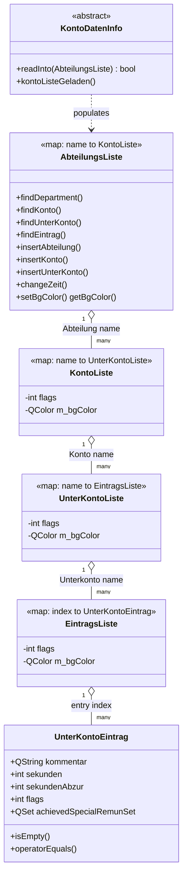
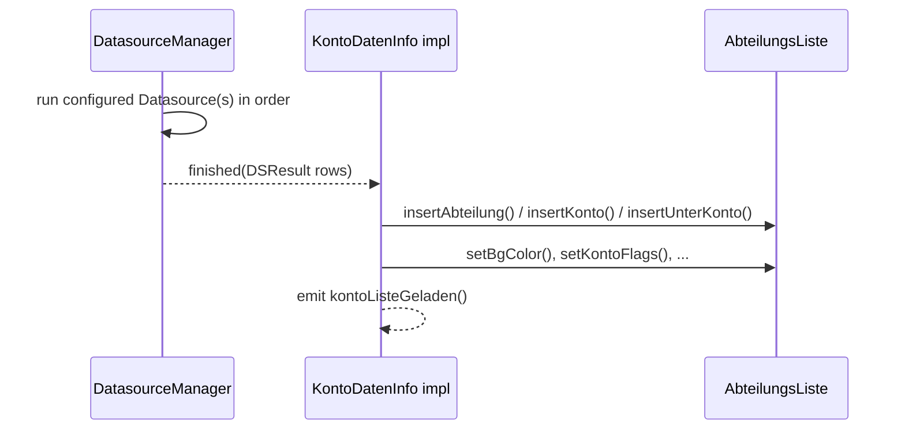

# Domain & Data Model

The entire account/time-booking model is a chain of **nested `std::map`s**, each
level adding metadata (flags, background color) on top of the map itself. This
avoids one dedicated tree-node class per level, at the cost of the map types all
looking similar. Keys are `QString` names (department, account, sub-account) except
at the leaf level, where the key is an integer entry index within a day.

## 1. Class diagram



## 2. Vocabulary mapping (German → English)

| German term | English meaning | C++ type |
|---|---|---|
| Abteilung | Department | key in `AbteilungsListe` |
| Konto | Account | key in `KontoListe` |
| Unterkonto | Sub-account | key in `UnterKontoListe` |
| Eintrag | Time entry (one day, one index) | `UnterKontoEintrag` |
| Sekunden | Seconds worked | `UnterKontoEintrag::sekunden` |
| SekundenAbzur | Billable seconds — the portion of worked time to be invoiced/settled with the customer | `UnterKontoEintrag::sekundenAbzur` |
| Kommentar | Comment/note text on an entry | `UnterKontoEintrag::kommentar` |
| Bereitschaft | On-call / standby duty | `BereitschaftsListe`, `BereitschaftsModel` |
| Zeitkonto | Time account | general term for a bookable account |
| Sonderzeitkategorie / SpecialRemuneration | Special remuneration category (e.g. night/holiday surcharge) | `SpecialRemunTypeList`, `UnterKontoEintrag::achievedSpecialRemunSet` |

See the full [Glossary](10-glossary.md) for more terms encountered in code and UI.

## 3. Flags

Each level (`KontoListe`, `UnterKontoListe`, `EintragsListe`) carries an `int flags`
bitfield, combined from these constants (defined in [abteilungsliste.h](../src/abteilungsliste.h)):

```cpp
#define IS_DISABLED     8   // greyed out / not selectable
#define IS_IN_DATABASE  4   // came from a persisted backend, not user-created
#define IS_CLOSED       2   // account is closed for new bookings
```

Flags are combined via one of several modes when calling `setXFlags(...)`:

```cpp
#define FLAG_MODE_OVERWRITE 0
#define FLAG_MODE_OR        1
#define FLAG_MODE_NAND      2
#define FLAG_MODE_XOR       3
```

## 4. Populating the model — `KontoDatenInfo`

`AbteilungsListe` is populated by any class implementing `KontoDatenInfo::readInto()`
— an adapter between a `Datasource` result (`DSResult = QList<QStringList>`, one row
of strings per account line) and the nested-map structure. This is the seam between
the [Data Sources layer](03-data-sources-backends.md) and the domain model.



## 5. Two account trees: "today" vs. the visible date

`TimeMainWindow` keeps **two** `AbteilungsListe` instances in play: one for the
currently *visible* (possibly past/future) date, and one specifically for
*today*, used to keep the running timer and "active account" bookkeeping correct
even while the user is browsing another date. See `AccountListCommiter`
(`abtList` vs. `abtListToday`) in [src/accountlistcommiter.h](../src/accountlistcommiter.h).

Continue with [Data Sources & Backends](03-data-sources-backends.md).
