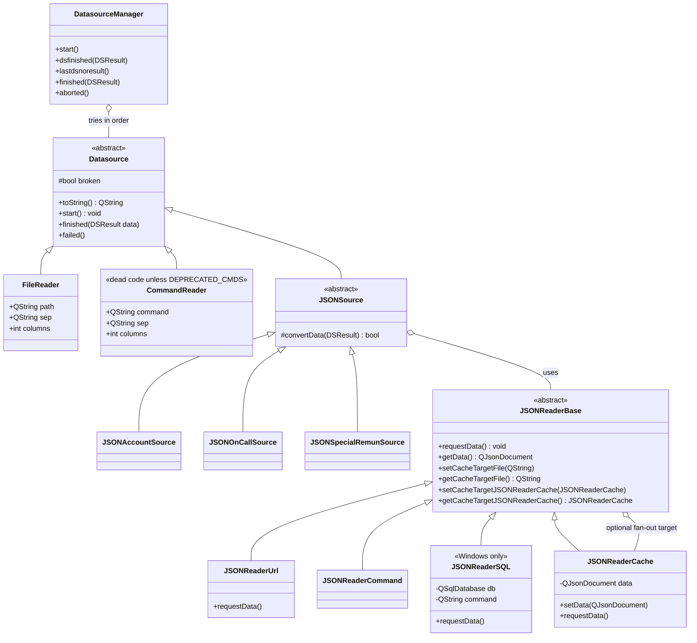
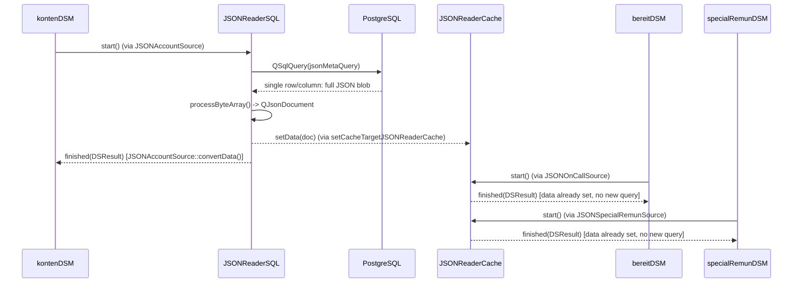
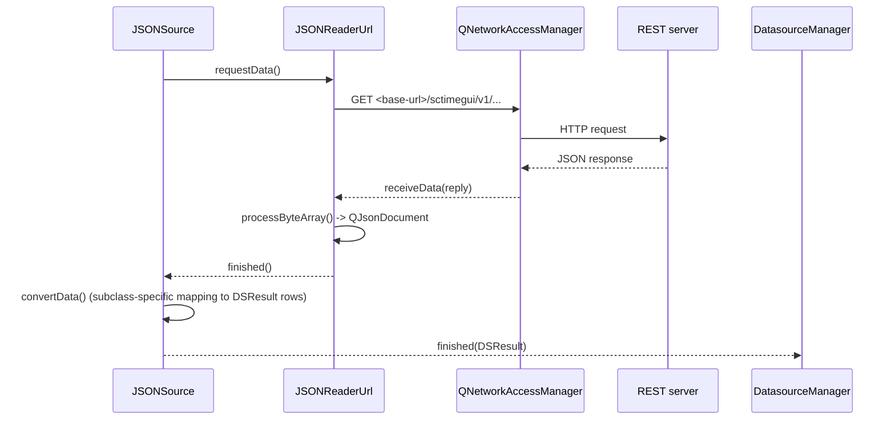

# Data Sources & Backends

sctime abstracts "where does the account list / on-call list / special
remuneration list come from" behind the `Datasource` interface, so the same UI
and domain model work whether data comes from a local file, a SQL query, a
shell command, or a REST/JSON endpoint.

## 1. The `Datasource` strategy pattern



`JSONReaderSQL` and `JSONReaderCache` are the pieces added to let a single SQL
query feed all three `DatasourceManager`s (accounts, on-call, special
remunerations) instead of running three separate queries. The tabular,
DSResult-returning `SqlReader` class it replaced has been removed from
[datasource.h](../src/datasource.h)/[.cpp](../src/datasource.cpp) entirely —
SQL access on Windows now goes exclusively through `JSONReaderSQL` (see below).

`DatasourceManager` tries each configured `Datasource` **in order** until one
succeeds (`finished`) or all fail (`aborted`). The default backend list is
`"QPSQL QODBC command json file"` — but which of those actually produce a
`Datasource` is platform-dependent; see below.

## 2. Where sources are wired up: `DSM` / `setupdsm`

[src/setupdsm.h](../src/setupdsm.h) / [.cpp](../src/setupdsm.cpp) builds three
`DatasourceManager`s at startup:

- `kontenDSM` — the account tree (departments/accounts/sub-accounts)
- `bereitDSM` — on-call ("Bereitschaft") categories
- `specialRemunDSM` — special remuneration categories

Each manager is populated with concrete `Datasource` instances depending on:

- the `backends` setting in `settings.xml` (or `--datasource=` CLI override),
- compile-time flags: `CommandReader`/`FileReader` are compiled out
  entirely on the **WASM build** (`RESTONLY` define, see
  [08-build-targets.md](08-build-targets.md)), leaving only the JSON/REST source,
- platform: the `"command"` backend is explicitly rejected on Windows
  (`setupdsm.cpp` logs an error and skips it).

This makes the two platforms diverge sharply from the shared default backend
list `"QPSQL QODBC command json file"`:

- **Windows**: `QPSQL`/`QODBC` resolve to a `QSqlDatabase` connection, and the
  actual data fetch goes through `JSONReaderSQL`; `"command"` is unavailable.
- **Unix/Linux**: `QPSQL`/`QODBC` are not used here. That leaves
  only `"command"`, `"json"`, and `"file"` producing a `Datasource` on 
  Unix, tried in that order. In practice this means **Unix
  desktop builds rely on an external command-line tool as their primary,
  first-tried datasource**, with the local JSON/flat-file backends as
  fallbacks — there is no in-process SQL or REST access unless an admin
  explicitly adds `"rest"` to the `backends` setting.

The `"command"` backend itself has changed shape over time. The `CommandReader`
class in [datasource.h](../src/datasource.h)/[.cpp](../src/datasource.cpp) —
which shells out to `zeitkonten`/`zeitbereitls`/`sonderzeitls` and parses
pipe-separated columns — is dead code today: it's only compiled in behind
`#ifdef DEPRECATED_CMDS`, which nothing in this repository defines. The
**currently active** implementation of `"command"` instead runs a single
external command, `zeit-sctime-offline`, via `JSONReaderCommand`
([JSONReader.cpp](../src/JSONReader.cpp)) — a synchronous `QProcess` call
that reads the command's stdout as the same
[offline data JSON schema](#5-offline-data-json-schema) used by the JSON/REST
sources, and feeds it into `JSONAccountSource`/`JSONOnCallSource`/
`JSONSpecialRemunSource`. So the legacy pipe-separated `CommandReader`
protocol has been fully superseded by a JSON-over-stdout contract with the
same external-tool integration point but a different wire format.

### SQL (Windows): one query feeds all three managers via `JSONReaderCache`

The `"command"` backend's JSON-over-stdout approach was later mirrored for
SQL. There used to be three separate hand-written queries
(`DSM::kontenQuery`/`bereitQuery`/`specialRemunQuery`, one per account/on-call/
special-remuneration table). These have been replaced by a single query,
`DSM::jsonMetaQuery` ([setupdsm.cpp](../src/setupdsm.cpp)):

```sql
select convert_to(f_sctime_master_data_jsonb()::text, 'UTF8')
```

This calls a single Postgres function that returns the *entire* master data
set — accounts, on-call categories, and special remunerations — as one JSONB
blob shaped like the [offline data JSON schema](#5-offline-data-json-schema),
serialized to a single-row, single-column text result.

`JSONReaderSQL` ([JSONReader.h](../src/JSONReader.h)/[.cpp](../src/JSONReader.cpp))
is the `JSONReaderBase` implementation that runs this query synchronously via
`QSqlQuery`, expecting exactly one row/column back, and feeds the result
through the normal `processByteArray()` → `QJsonDocument` path. Since one query
now answers for all three `DatasourceManager`s, `setupdsm.cpp` fetches it only
**once** and fans the parsed document out via `JSONReaderCache`:



`JSONReaderCache::requestData()` simply checks whether `setData()` has already
been called: if so it emits `finished()` immediately, otherwise `aborted()`.
This only works reliably because `kontenDSM` is started (and finishes) before
`bereitDSM`/`specialRemunDSM` try to read from the shared cache — if the query
fails, the cache is never populated and the on-call/special-remuneration
managers fail over to whatever comes after `"command"`/`"json"`/`"file"`/`"rest"`
in their own backend lists, same as any other failed datasource.

## 3. REST/JSON backend

`JSONReaderUrl` is dual-purpose: it's the same class whether it's pointed at a
`file://` URL (the `"json"` backend — a local cached/offline JSON document,
e.g. `sctime-offline.json`) or an `http(s)://` REST endpoint (the `"rest"`
backend, or the WASM build's always-on `RESTONLY` datasource, see
[08-build-targets.md](08-build-targets.md)) — `QNetworkAccessManager` handles
both URL schemes transparently. Only the REST/network case is a "backend"
in the network sense; the diagram below shows that case:



Key REST endpoints (defined in [globals.h](../src/globals.h)):

| Constant | Path | Purpose |
|---|---|---|
| `REST_SETTINGS_ENDPOINT` | `sctimegui/v1/settingsdata` | Per-day settings/time entries |
| `REST_LIST_SETTINGS_ENDPOINT` | `sctimegui/v1/listsettingsdata` | List of changed settings files since a timestamp (used by [offline sync](05-offline-sync-conflicts.md)) |
| `REST_COMMITED_ENDPOINT` | `sctimegui/v1/commiteddata` | Committing a finalized account list |
| `REST_ACCOUNTINGMETA_ENDPOINT` | `sctimegui/v1/accountingmetadata` | Account tree / accounting metadata |

The base URL comes from the `SCTIME_BASE_URL` environment variable — or, in the
WASM build, is derived from `window.location` when unset (see
[src/resthelper.cpp](../src/resthelper.cpp)). `getStaticUrl()` similarly resolves
static asset URLs (`REFRESH_URL_PART`, `KEEPALIVE_URL_PART` — used for session
refresh/keepalive pages loaded in the browser, see `login.html`/`refresh.html`).

## 4. `DSResult` — the common currency

All datasources ultimately produce a `DSResult`:

```cpp
typedef QList<QStringList> DSResult;
```

A flat list of string rows, independent of the storage technology — the
`KontoDatenInfo` layer (see [Domain & Data Model](02-domain-data-model.md)) is
the only place that interprets column positions and turns rows into the
`AbteilungsListe` tree.

## 5. Offline data JSON schema

The JSON/REST datasources (and the WASM offline export/import flow) exchange
data shaped as a single top-level document with three sections: the account
tree, on-call ("Bereitschaft") categories, and special remuneration
categories. Required fields are marked; fields marked "not for external use"
are populated for internal accounting but should not be relied upon by
external consumers of this format.

```jsonc
{
  "AccountTree": {                     // required
    "Departments": [                   // required
      {
        "Name": "<department name>",   // required
        "Accounts": [                  // required
          {
            "Name": "<account name>",           // required
            "CostCenter": "<cost center>",       // not for external use
            "ResponsiblePersons": [
              "<account owner>",
              "<account deputy>"
            ],
            "InvoicedUntil": "YYYY-MM-DD",        // not for external use
            "NoEntriesBefore": "YYYY-MM-DD",       // not for external use
            "SubAccounts": [                       // required
              {
                "Name": "<sub-account name>",      // required
                "ResponsiblePersons": [
                  "<sub-account owner>",
                  "<sub-account deputy>"
                ],
                "Category": "<TAV category>",
                "Description": "<description>",
                "PSP": "<PSP element>",             // not for external use
                "SpecialRemunerations": [
                  "<remuneration category 1>", "..."
                ],                                   // atm not for external use
                "MicroAccounts": [
                  "<micro-account 1>", "..."
                ]
              }
              // ... further sub-accounts
            ]
          }
          // ... further accounts
        ]
      }
      // ... further departments
    ]
  },
  "OnCallTimes": [
    {
      "Category": "<category>",        // required
      "Description": "<description>"
    }
    // ... further on-call time categories
  ],
  "SpecialRemunerations": [
    {
      "Category": "<category>",        // required
      "IsGlobal": 1,                   // required
      "Description": "<description>"
    }
    // ... further special remuneration categories
  ]
}
```

This is the same schema consumed by `JSONAccountSource`, `JSONOnCallSource`,
and `JSONSpecialRemunSource` (see the class diagram above) when reading from
the REST API, and it is also the format used for manual/offline import-export
of an account tree (e.g. for the WASM build's *Download SH files* flow, see
[07-ui-layer.md](07-ui-layer.md)).

Continue with [Settings, Persistence & XML](04-settings-persistence.md).
