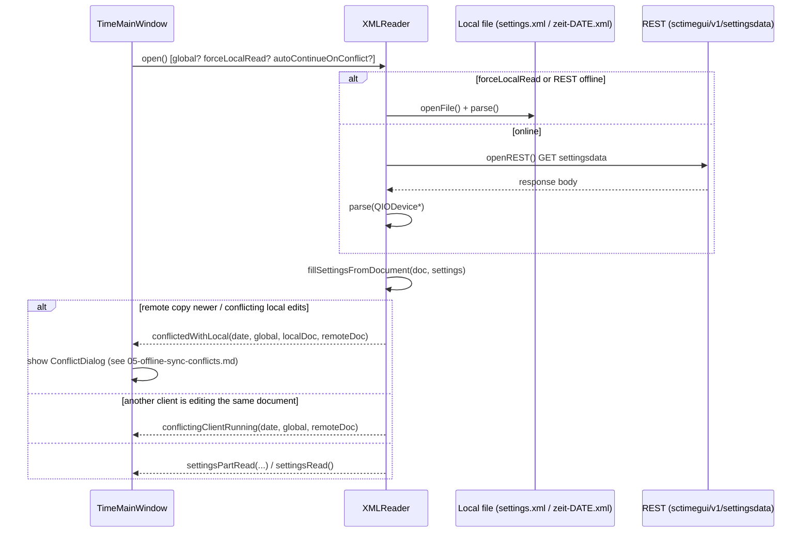
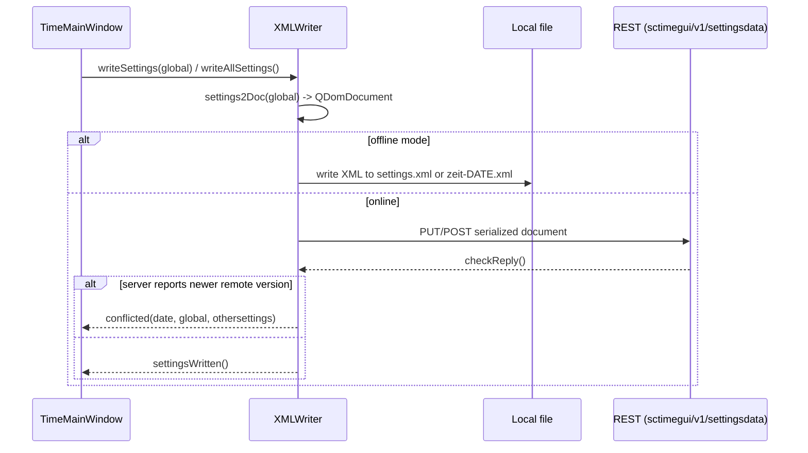

# Settings, Persistence & XML

## 1. On-disk layout

All local state lives under the config directory (`configDir`, default
`~/.sctime`, overridable with `--configdir=DIR`):

| File | Written by | Contents |
|---|---|---|
| `settings.xml` (+ `.bak` backup) | `XMLWriter::writeSettings(global=true)` | Global settings: window geometry, backends, comment defaults, punch-clock/on-call config, night-mode, columns, feature toggles |
| `zeit-YYYY-MM-DD.xml` | `XMLWriter::writeSettings(global=false)` | One file per day: that day's `AbteilungsListe` (bookings) + punch clock state |
| `zeit-YYYY-MM-DD.sh` | `SCTimeXMLSettings` (via `configDir.filePath(...)`) | Legacy shell-script-format export of a day's bookings, also used by *Download SH files* |
| `lastsync.txt` | `SyncOfflineHelper::setLastSyncTime()` | Timestamp of last successful REST sync |
| `machineid.txt` | `sctime.cpp` | Cached machine identifier used as REST client ID |
| `defaultcomments.xml` | (read-only asset) | Default per-account comment texts, read via `DefaultCommentReader` |

`settings.xml` and `zeit-*.xml` are the two "documents" the rest of the system
calls **global** vs. **non-global** (per-day) settings — the same `XMLReader`
and `XMLWriter` handle both, parameterized by a `global` bool.

## 2. `SCTimeXMLSettings` — the settings god object

`SCTimeXMLSettings` ([src/sctimexmlsettings.h](../src/sctimexmlsettings.h)) is a
single `QObject` holding **every** user-configurable value as a plain data
member with matching getters/setters — window geometry, data-source backend
list, time increments, comment display mode, punch-clock warnings on/off,
custom fonts, REST offline state, and more. It declares `XMLReader`/`XMLWriter`
as `friend class` so they can read/write its private fields directly during
(de)serialization, avoiding a large public setter surface just for I/O.

Defaults are set directly in the constructor (see the snippet in
[01-architecture-overview.md](01-architecture-overview.md) style — e.g.
`defaultbackends = "QPSQL QODBC command json file"`, `timeInc = 5*60` seconds).

## 3. Read/write flow

## 4. Backups & safety

- `backupSettingsXml` (default `true`) makes `XMLWriter` keep `settings.xml.bak`
  before overwriting `settings.xml`, so a corrupt write can be recovered from
  manually.
- `Delete configuration data` ([deletesettingsdialog.cpp](../src/deletesettingsdialog.cpp))
  is the user-facing "nuke everything" escape hatch — it globs `zeit-*.xml` and
  `zeit-*.sh` alongside `settings.xml`/`settings.xml.bak` for deletion.

## 5. Default comments & tags

Two small reader classes complement `XMLReader`:

- `DefaultCommentReader` ([src/defaultcommentreader.h](../src/defaultcommentreader.h)) —
  loads `defaultcommentfiles` (default: `defaultcomments.xml`) to pre-fill likely
  comment text per account/sub-account.
- `DefaultTagReader` ([src/defaulttagreader.h](../src/defaulttagreader.h)) —
  similar mechanism for tag-like metadata.

Continue with [Offline Sync & Conflict Resolution](05-offline-sync-conflicts.md).
