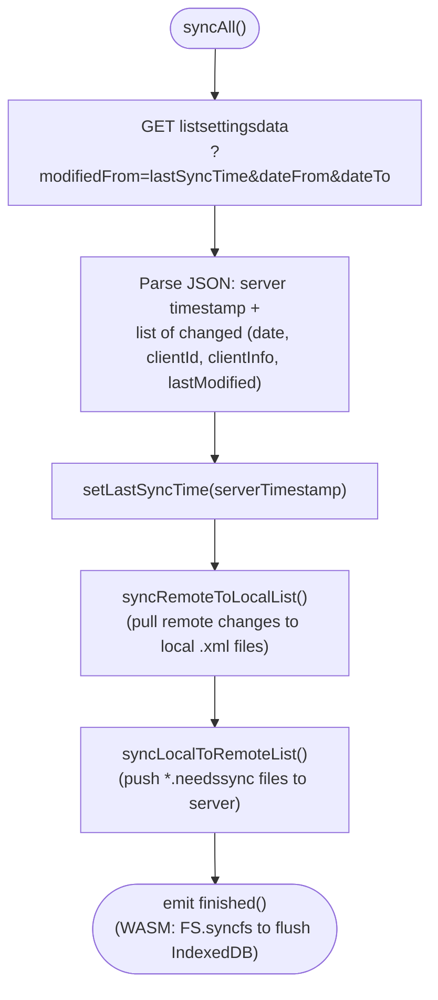
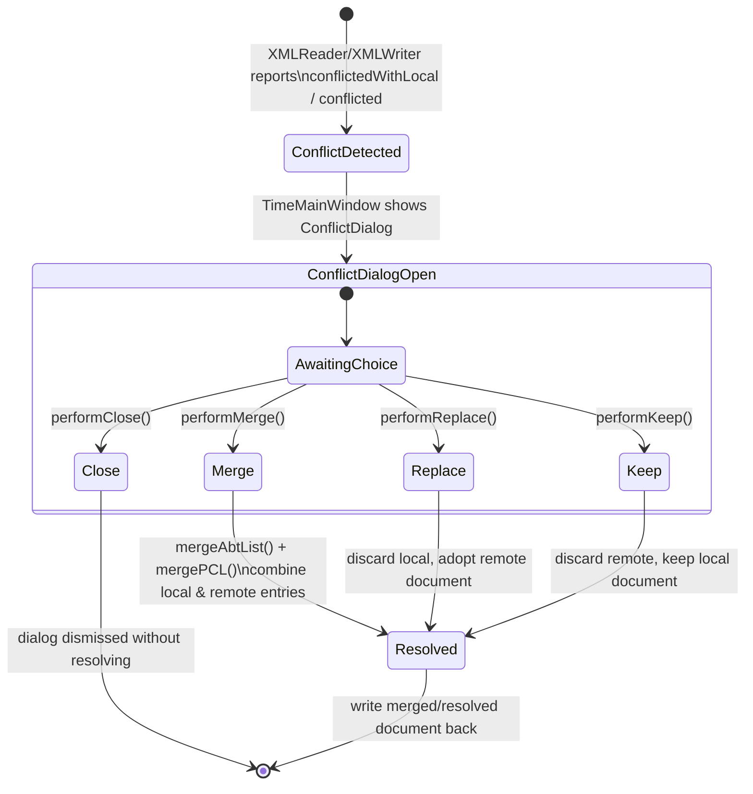

# Offline Sync & Conflict Resolution

sctime is designed to keep working when the network is unavailable, and to
reconcile changes afterwards. This is the most intricate subsystem in the
codebase, spanning `SyncOfflineHelper`, `XMLReader`/`XMLWriter`, and
`ConflictDialog`.

## 1. When sync happens

- On startup and periodically while running, driven by `TimeMainWindow`.
- Explicitly, e.g. when leaving offline mode (`m_restCurrentlyOffline` flag in
  `SCTimeXMLSettings`).
- Always for the WASM build on state changes, since the browser tab could be
  closed at any time (`// for wasm also sync` in `timemainwindow.cpp`).

## 2. `SyncOfflineHelper::syncAll()` — the two-phase sync

Both phases are asynchronous and use a shared `partstodo` counter
(incremented per pending file operation, decremented in
`nextStepRemoteToLocal`/`nextStepLocalToRemote`) so the corresponding
`finishedRemoteToLocal`/`finishedLocalToRemote` signal only fires once every
file in that phase has been processed — a manual "join" over N async
operations, since Qt has no built-in `Promise.all`.

### Remote → Local (`syncRemoteToLocalList`)

For each changed date reported by the server:

1. Skip if the local file's own modification time is already ≥ the reported
   remote time and the client ID matches (we wrote it ourselves).
2. Skip if that date is the one currently open in the UI (avoid clobbering
   in-memory edits).
3. Otherwise, read the remote day via `XMLReader` (`forceLocalRead=false`) into
   a scratch `AbteilungsListe`, and write it back out **locally** via
   `XMLWriter::settings2Doc()`:
   - If no local file exists yet for that date, write directly to
     `zeit-DATE.xml`.
   - If a local file **does** exist, write to `zeit-DATE.xml.unmerged` instead,
     and mark the date in `uncleanDates` — it will need conflict resolution
     rather than being blindly overwritten.
4. Compare `(remoteID, remoteDate)` vs. `(localID, localDate)` (read from the
   document root's `identifier`/`date` attributes) to detect no-op vs.
   stale-remote vs. genuine-conflict cases before deciding whether to write at
   all.

### Local → Remote (`syncLocalToRemoteList`)

- Scans `configDir` for `*.needssync` marker files (written whenever a local
  edit happens while offline — see `SyncOfflineHelper::setNeedSyncMark`).
- For each one, if the server hasn't already reported a newer version for that
  date, uploads the corresponding `zeit-DATE.xml` via `XMLWriter`.

## 3. Conflict resolution UI

When `XMLReader` detects that a local and a remote copy of the same day both
changed (`conflictedWithLocal`), or that another client session is already
editing the same document (`conflictingClientRunning`), `TimeMainWindow` opens
a `ConflictDialog` ([src/conflictdialog.h](../src/conflictdialog.h)).

- `performMerge()` calls `mergeAbtList()` / `mergePCL()` to combine the two
  `AbteilungsListe`/`PunchClockList` instances entry-by-entry rather than
  picking one side wholesale — this is the safest option and the one the UI
  recommends by default for genuine concurrent edits.
- `performReplace()` / `performKeep()` are the "just pick a side" escape
  hatches for when the user knows one side is authoritative.
- A separate lightweight `ConflictDialogSameBrowser` (a `QMessageBox`) handles
  the narrower case of two tabs of the same browser fighting over the same
  IndexedDB-backed storage in the WASM build.

## 4. Related: `AccountListCommiter`

When a freshly loaded/edited account list needs to be "committed" (written
out, then reloaded to normalize view state), `AccountListCommiter`
([src/accountlistcommiter.h](../src/accountlistcommiter.h)) orchestrates:
`start()` → `reloadAbtList()` → `reloadAbtListToday()` →
`writeAbtListToday()` → `finish()`, with `cleanupOnErr()` as the failure path.
It exists so `TimeMainWindow` doesn't have to inline this multi-step,
signal-driven sequence itself.

Continue with [Punch Clock & On-Call Tracking](06-punchclock-oncall.md).
