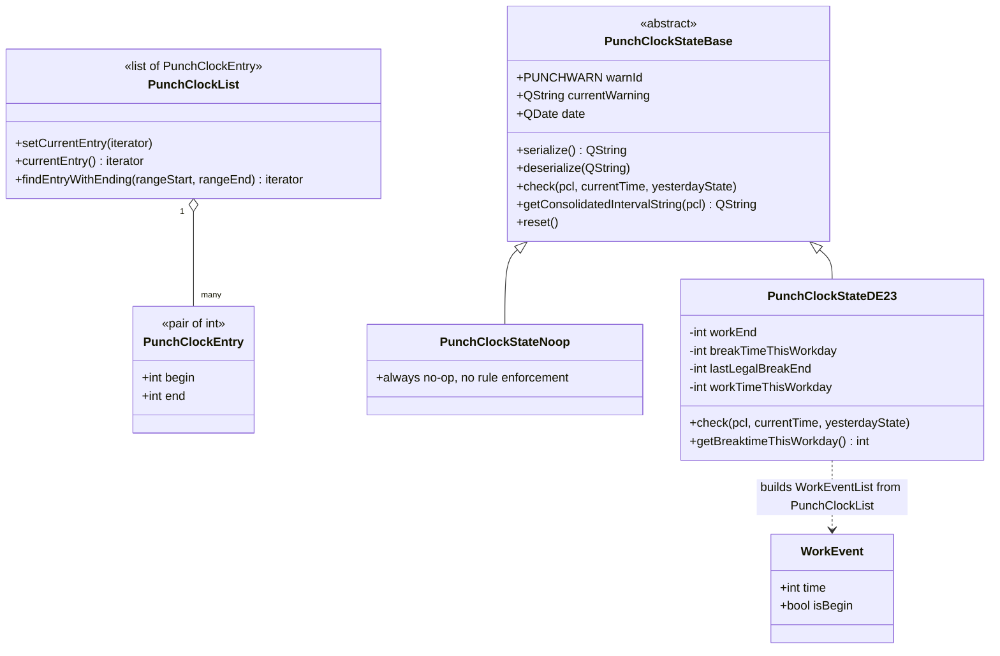
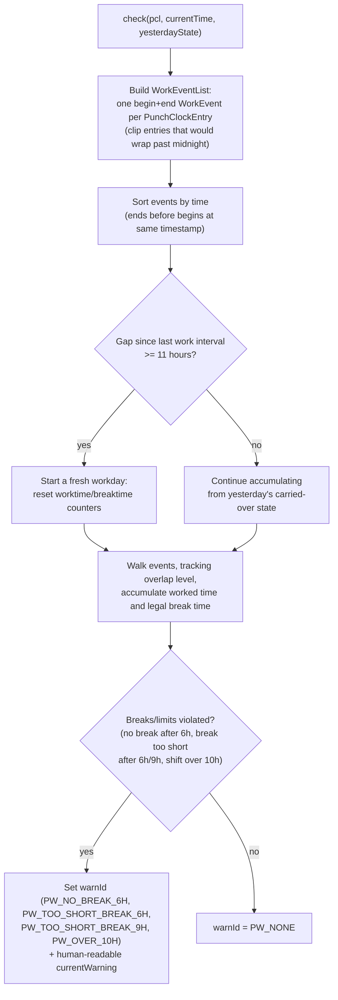

# Punch Clock & On-Call Tracking

sctime tracks two things beyond plain project-time booking:

1. **Punch clock ("Stempeluhr") compliance** — checking recorded work intervals
   against legally required break times (Germany: `PunchClockStateDE23`,
   named after the applicable regulation "§ 23").
2. **On-call / standby duty ("Bereitschaft")** — a separate category of time
   with its own list/model, orthogonal to the department/account tree.

## 1. Punch clock data model

`newPunchClockState()` (a factory function in
[punchclockchecker.h](../src/punchclockchecker.h)) returns either the no-op or
the DE23 implementation depending on the `DISABLE_PUNCHCLOCK` compile define —
sites/tenants that don't need break-time enforcement can compile it out
entirely while keeping the same interface.

## 2. How `check()` works (state machine, simplified)

The `PUNCHWARN` enum values map directly to German labor-law break rules:
after 6 hours worked, a break is required; that break must reach a minimum
length; after 9 hours, a longer break is required; and total work must not
exceed roughly 10 hours in a shift. `PunchClockStateBase::copyFrom()` /
`getDate()`/`setDate()` let the daily state be threaded across day boundaries
(`yesterdayState` parameter) so the 11-hour-rest-before-new-workday rule can
span midnight correctly.

State round-trips to disk via `serialize()`/`deserialize()` as part of the
per-day XML document written by `XMLWriter` (see
[04-settings-persistence.md](04-settings-persistence.md)) — this is why
`PunchClockStateBase` exposes plain string (de)serialization rather than
relying on Qt's XML DOM directly.

`TestPunchClockChecker` (see [09-testing.md](09-testing.md)) is declared a
`friend class` of `PunchClockStateDE23` specifically to unit test its private
counters.

## 3. On-call / "Bereitschaft" tracking

On-call time is a parallel, simpler system:

- `BereitschaftsListe` / `BereitschaftsDatenInfo` — analogous to
  `AbteilungsListe`/`KontoDatenInfo`, but for on-call category entries instead
  of the department/account tree.
- `BereitschaftsModel` ([src/bereitschaftsmodel.h](../src/bereitschaftsmodel.h)) —
  a `QAbstractTableModel` singleton (`getInstance()`) exposing the current
  on-call categories and which are selected, backing the on-call UI.
- `BereitschaftsView` / `OnCallDialog` — the UI surface for selecting which
  on-call categories apply on a given day.
- Data source: like accounts, on-call categories can come from SQL, the
  legacy `zeitbereitls` command, or the JSON/REST source
  (`bereitDSM` in [setupdsm.h](../src/setupdsm.h) — see
  [03-data-sources-backends.md](03-data-sources-backends.md)).

Continue with [UI Layer](07-ui-layer.md).
