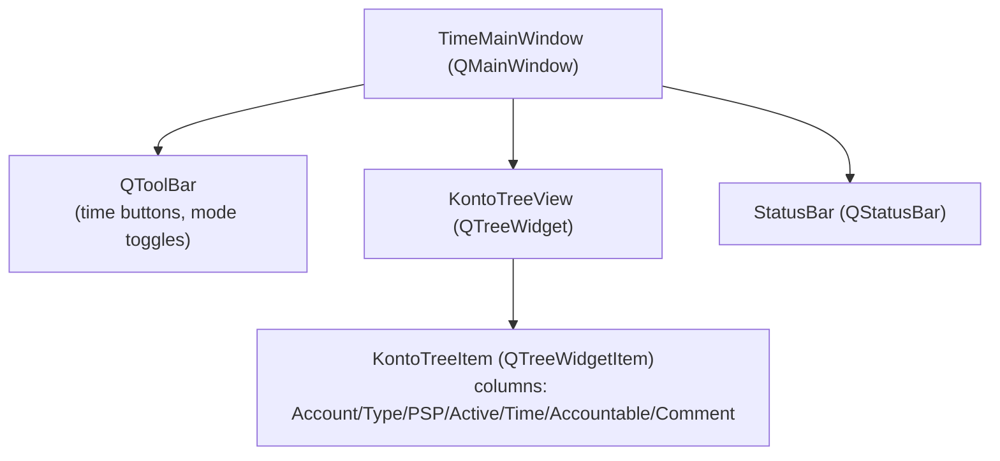
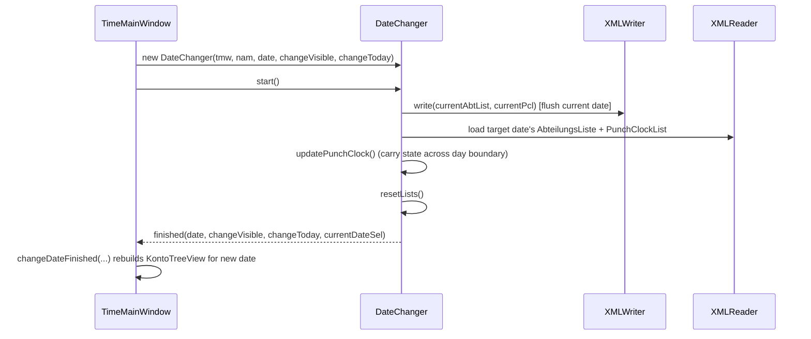

# UI Layer

## 1. `TimeMainWindow` — the application shell

`TimeMainWindow` ([src/timemainwindow.h](../src/timemainwindow.h)) is a
`QMainWindow` that is simultaneously:

- the **timer**: a 60-second tick (`minuteHochzaehlen()`) plus a wall-clock
  drift check (`driftKorrektur()`) advance the active entry's booked time,
- the **selection controller**: signals like `eintragSelected`,
  `unterkontoSelected`, `augmentableItemSelected`, `aktivierbarerEintragSelected`
  reflect what kind of tree node is currently selected, driving which toolbar
  actions/buttons are enabled,
- the **dialog launcher**: `callUnterKontoDialog`, `callFindKontoDialog`,
  `callPreferenceDialog`, `callBereitschaftsDialog`,
  `callSpecialRemunerationsDialog`, `callPunchClockDialog`,
  `callDownloadSHDialog`, `callDeleteSettingsDialog`, etc.,
- the **persistence/sync coordinator**: `save`, `saveWithTimeout`,
  `syncAll`, `writeConflictDialog`, `readConflictDialog`,
  `readConflictWithLocalDialog`, `sessionInvalid`,
- and the **mode switchboard**: `switchOvertimeRegulatedMode`,
  `switchOvertimeOtherMode`, `switchPublicHolidayMode`, `switchNightMode`,
  `switchRestCurrentlyOffline`.

Because so much is centralized here, `TimeMainWindow` is by far the highest
fan-out type in the codebase (228 edges per the code graph) — when in doubt
about "who calls what", start by grepping this header's slot list.

## 2. Widget tree (typical layout)



`KontoTreeView` ([src/kontotreeview.h](../src/kontotreeview.h)) renders
`AbteilungsListe` as a tree, handles keyboard/mouse events
(`eventFilter`, `dropEvent`, drag & drop of time between accounts via the
custom MIME types `MIMETYPE_ACCOUNT`/`MIMETYPE_SECONDS`), and offers
name-based lookup helpers (`sucheItem`, `sucheKontoItem`,
`sucheUnterKontoItem`) used by dialogs like `FindKontoDialog` to
jump to a specific tree node.

## 3. Key dialogs

| Dialog | Purpose |
|---|---|
| `UnterKontoDialog` | Edit/create sub-account entries, set comment & special remunerations |
| `FindKontoDialog` | Fuzzy/incremental search across the account tree, jump to result |
| `PreferenceDialog` | User preferences: columns, fonts, click mode, comment display mode |
| `DateDialog` / `DateChangeDialog` | Pick / confirm switching the visible date |
| `ConflictDialog` / `ConflictDialogSameBrowser` | Resolve sync conflicts (see [05-offline-sync-conflicts.md](05-offline-sync-conflicts.md)) |
| `ConflictCalendarWidget` | Calendar picker highlighting days with unresolved conflicts |
| `OnCallDialog` | Choose on-call ("Bereitschaft") categories for a sub-account |
| `SpecialRemunerationsDialog` / `SpecialRemunEntryHelper` | Assign special remuneration categories to an entry |
| `PunchClockDialog` | Show punch-clock status/warnings (compiled out if `DISABLE_PUNCHCLOCK`) |
| `PauseDialog` | Pause/resume timer, e.g. for breaks |
| `DownloadSHDialog` | Export `zeit-*.sh` files for a date range as a `.zip` (WASM build only, `DOWNLOADDIALOG` define) |
| `DeleteSettingsDialog` | "Nuke local data" — delete `settings.xml`/`zeit-*` files |
| `TextViewerDialog` | Generic read-only text/help viewer (About box, help pages, license notices) |
| `LoginDialog` | Non-WASM login flow (currently disabled in `src.pro`, see [08-build-targets.md](08-build-targets.md)) |

## 4. `DateChanger` — switching the visible date

Switching dates is non-trivial because it may need to flush pending writes,
reload punch-clock state across the day boundary, and distinguish "the date
the user is looking at" from "today" (used for the live timer). `DateChanger`
([src/datechanger.h](../src/datechanger.h)) encapsulates this as its own
small state machine:



## 5. `sctime://` deep links & Windows URL protocol registration

Entries in the account tree can be copied/pasted as shareable links (e.g. in
a chat message or ticket) via `copyEntryAsLink()` /
`pasteEntryAsLink()` / `openEntryLink()` in
[timemainwindow.cpp](../src/timemainwindow.cpp). The link format is a custom
`sctime:` URL:

```
sctime://local/<department>/<account>/<sub-account>?comment=<url-encoded comment>
```

Opening such a link (`openEntryLink`) navigates the tree straight to that
sub-account (and pre-fills the comment, if present) via
`openItemFromPathList`.

For this to work when clicked outside the app (e.g. from a browser or another
application), the desktop OS must know that `sctime:` URLs should be handed to
the sctime executable. On Windows this is done with a `.reg` file that
registers the protocol handler under the current user's registry hive:

```reg
Windows Registry Editor Version 5.00

[HKEY_CURRENT_USER\SOFTWARE\Classes\sctime]
"URL Protocol"=""

[HKEY_CURRENT_USER\SOFTWARE\Classes\sctime\shell\open\command]
@="\"c:\\tmp\\dist\\sctime.exe\" \"--accountlink=%1\""
```

An example is checked in at
[doc/registerlink.reg.example](registerlink.reg.example) — copy it, adjust
the path to the installed `sctime.exe`, and import it (double-click, or
`reg import`) once per user/machine to enable clicking `sctime:` links.

```mermaid
sequenceDiagram
    participant Link as sctime:// link (clicked by user)
    participant OS as Windows shell
    participant Proc as sctime.exe process
    participant Lock
    participant Existing as already-running sctime instance

    Link->>OS: sctime://local/Dept/Account/SubAccount?comment=...
    OS->>Proc: launch sctime.exe --accountlink=<url>
    Proc->>Lock: acquire()
    alt no instance running yet
        Lock-->>Proc: acquired
        Proc->>Proc: startup as usual, then openEntryLink(url)
    else another instance already running
        Lock-->>Proc: LS_CONFLICT
        Proc->>Existing: send {"type":"accountlink","link":url} over QLocalSocket (SCTIME_IPC)
        Existing->>Existing: readIPCMessage() -> openEntryLink(url)
        Proc->>Proc: exit (this process was just a messenger)
    end
```

The same `--accountlink=URL` CLI flag is also documented in `sctime --help`
(see [sctime.cpp](../src/sctime.cpp)) and works standalone, without the
registry entry, for scripting/testing.

Continue with [Build Targets & Packaging](08-build-targets.md).
