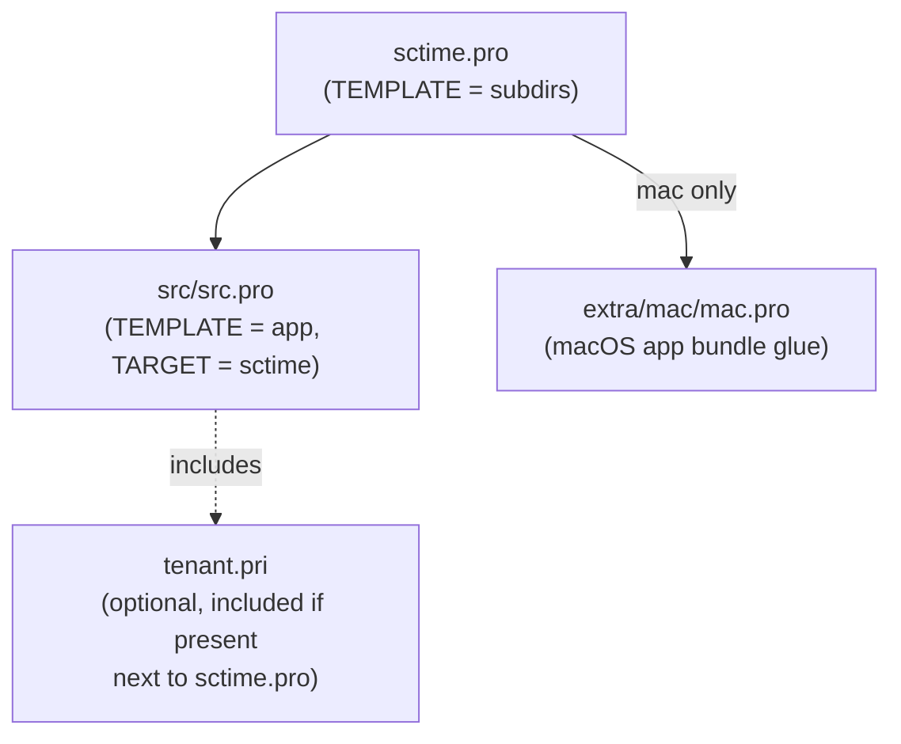

# Build Targets & Packaging

sctime uses **qmake** (not CMake). The top-level [sctime.pro](../sctime.pro) is
a `subdirs` project that descends into [src/src.pro](../src/src.pro) (and, on
macOS, `extra/mac`). There is no single "build everything" script — the target
platform is selected via qmake `CONFIG`/scope variables (`wasm`, `win32`,
`win32-msvc*`, `win32-g++*`, `mac`).



## 1. Desktop build (Linux / Windows / generic Qt)

```bash
mkdir build && cd build
qmake -r /path/to/sctime.pro   # generates Makefile(s)
make -j4                        # or gmake -j4 / nmake, per platform
src/sctime                      # run
```

Requirements: a Qt install with `xml gui core network widgets` (and `sql` on
Windows, see `win32 { QT += sql }` in [src/src.pro](../src/src.pro)). C++11 is
required (`CONFIG += c++11`). `VERSION` is derived from `git describe` at
qmake time and baked in as `APP_VERSION` — re-run qmake (not just make) after
tagging or changing branches if the version string matters.

Platform specifics:

- **Windows (MSVC)**: needs the Qt SQL ODBC/PostgreSQL driver plugins
  (`qsqlodbc*.dll` / `qsqlpsql*.dll`), links `advapi32.lib`, embeds
  `sctime.rc` as the executable manifest/icon.
- **Windows (MinGW/g++)**: same manifest/icon handling via `-ladvapi32`.
  instead of the MSVC lib name.
- **Unix**: uses `CommandReader` (`zeitkonten`/`zeitbereitls` external tools)
  as a fallback datasource when no SQL/REST backend is configured; packaging
  helper at [extra/unix/packen](../extra/unix/packen).
- **macOS**: additional `extra/mac/mac.pro` subdirectory build, with a
  dedicated `Info.plist`, distribution script
  (`extra/mac/sctime-mac-dist`), and vendored patches for qmake itself
  (`patchqmake.c-*.patch`) to work around macOS/Qt build quirks — see
  [extra/mac/README.dependencies](../extra/mac/README.dependencies) for
  details before attempting a macOS build.
- **Windows installer**: [sctime-setup/sctime-setup.vdproj](../sctime-setup/sctime-setup.vdproj)
  is a Visual Studio installer project producing the `.msi` package
  referenced in [README.SC](../README.SC).

## 2. WebAssembly build

Building with a WASM-enabled Qt kit (`CONFIG += wasm`, e.g. via
`qt-cmake`/`qmake` from a Qt-for-WebAssembly installation) changes the build
substantially — see the `wasm { ... }` block in
[src/src.pro](../src/src.pro):

| Effect | Why |
|---|---|
| `DEFINES += RESTONLY RESTCONFIG WASMQUIRKS DOWNLOADDIALOG` | No local SQL/command-line datasources exist in a browser sandbox; REST/JSON is the only backend. `WASMQUIRKS` gates workarounds for browser-specific Qt Widgets quirks (e.g. forcing dialogs modal — see comment in `timemainwindow.cpp`). `DOWNLOADDIALOG` enables the "Download SH files" export dialog, the WASM user's way to get data out of the browser sandbox. |
| `SOURCES/HEADERS/FORMS += downloadshdialog.*` | Only built for WASM |
| `-lidbfs.js -sASYNCIFY` linker flags | Persist the virtual filesystem to the browser's IndexedDB (`idbfs.js`) and allow synchronous-looking code to yield to the browser event loop (`ASYNCIFY`), since blocking I/O isn't possible in a browser tab |
| `QTPLUGIN.imageformats = qico qgif` | Explicitly pull in the image plugins needed for icons in the browser build |
| `-gseparate-dwarf` / `DWARF_URL` | Split debug symbols out of the shipped `.wasm` for a smaller download, fetched on demand while debugging |

Emscripten-specific code throughout `src/*.cpp` is guarded with
`#ifdef __EMSCRIPTEN__` — notable examples: mounting the persistent IndexedDB
filesystem at startup (`sctime.cpp`), deriving the REST base URL from
`window.location` when `SCTIME_BASE_URL` isn't set
([resthelper.cpp](../src/resthelper.cpp)), and opening browser windows/tabs for
help and session-refresh via `emscripten_run_script`.

The WASM build ships its own HTML host page,
[src/sctime2.html](../src/sctime2.html), which loads a **split** `.wasm`
archive (`sctime.wasm.part*`, reassembled client-side) to improve HTTP cache
hit rates across deploys — see the comment at the top of that file for the
`split` command used to produce the parts. Companion pages `login.html`,
`login_action.html`, and `refresh.html` implement the browser-side session
login/keepalive flow referenced by `REFRESH_URL_PART`/`KEEPALIVE_URL_PART`
in [globals.h](../src/globals.h).

## 3. Tenant customization (`tenant.pri`)

An optional [tenant.pri](../tenant.pri) file next to `sctime.pro` is included
automatically if present (`exists($$PWD/../tenant.pri) { include(...) }` in
`src.pro`). It's the seam for building a customized/white-labeled variant
without touching tracked source — currently used to set:

- `DEFINES += ATOS_ETV_2018` / `PUNCHCLOCKDE23` — which punch-clock legal
  ruleset is compiled in,
- `TENANT_HELP_ITEM_NAME` / `TENANT_HELP_ITEM_URL` — branding for the
  "Documentation" help menu entry and its target URL.

If you're building for a different organization, copy/adjust `tenant.pri`
rather than editing `src.pro` directly.

## 4. Legal notices

[generate_additional_legal.sh](../generate_additional_legal.sh) packs
third-party `licenses/` and `sources/` directories (not tracked in this repo)
into `src/additional_legal.qrc`, which `src.pro` includes automatically if
present. Run it once before building if you need to embed additional license
text/attributions into the shipped binary (e.g. for a redistributable
package).

Continue with [Testing](09-testing.md).
